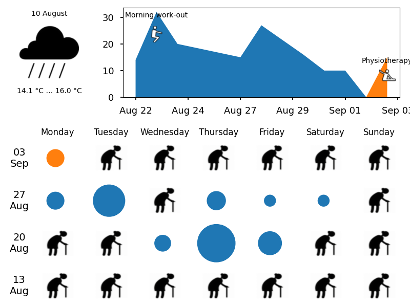

[](https://github.com/andgineer/docker-iot-calendar/actions)[](https://htmlpreview.github.io/?https://github.com/andgineer/docker-iot-calendar/blob/python-coverage-comment-action-data/htmlcov/index.html)

[Docker Hub container](https://hub.docker.com/r/andgineer/iot-calendar)
that generates image for Amazon Kindle.



The image contains calendar with events from Google Calendar - supposedly events from your IoT devices
(like [Smart wifi button (Amazon Dash Button hack)](https://sorokin.engineer/posts/en/amazon_dash_button_hack.html)).

You can point your Kindle browser to html-page that updates the image every minute.
So you can see the calendar on your Kindle.

## Usage
Read [description in my blog](https://sorokin.engineer/posts/en/iot_calendar_synology.html).

## Prepare environment
Detailed manual how to create Google and open weather credentials is in the blog post mentioned above.

Roadmap:
* Create Google project
* Create Google service account
* Enable [Google Calendar API](https://console.cloud.google.com/apis/api/calendar-json.googleapis.com/metrics)
* [Create key](https://console.cloud.google.com/iam-admin/serviceaccounts/details/110121235683045242579;edit=true/keys) -> Add Key -> JSON
* replace `amazon-dash-hack.json` in `amazon-dash-private` folder with downloaded file
* Create Google calendar wheret your IoT device will publish events (like [Amazon Dash Button](https://sorokin.engineer/posts/en/amazon_dash_button_hack.html))
* Share Google calendar with service account
* Create OpenWeatherMap API key and place it into `amazon-dash-private/openweathermap.key` file


## Local run

Prepare secrets as described in the blog post mentioned above.

Copy `amazon-dash-private` folder up one level, so it will be in the same folder as `docker-iot-calendar` project.
Place your secrets to this folder copy.

Run in the `docker-iot-calendar` folder:
```
make run
```

Local address for the calendar page `http://localhost:4444`

## Development

At first I thought it would be great idea to use
[svgwrite](http://svgwrite.readthedocs.io/en/master/attributes/presentation.html),
and [cairosvg](http://cairosvg.org/documentation/), but then decided otherwise
and use [matplotlib](http://matplotlib.org) instead.

### Development dependencies

To install system dependencies in Mac OSX (if you want to run it outside docker container):
```
brew update
brew install cairo
```

### Matplotlib fonts

You have to install [Humor font](http://antiyawn.com/uploads/humorsans.html),
[xkcd font](https://github.com/ipython/xkcd-font) or [xkcd font](https://github.com/andgineer/docker-matplotlib/blob/master/xkcd.otf)
and [Comic Neue](https://fonts.google.com/specimen/Comic+Neue).

If you already had matplotlib installed, after font installation you have to remove `~/.matplotlib/fontList.json`.

### HTTP server
As HTTP server I use [tornado](http://www.tornadoweb.org/en/stable/).

## Performance

https://andgineer.github.io/docker-iot-calendar/dev/bench
